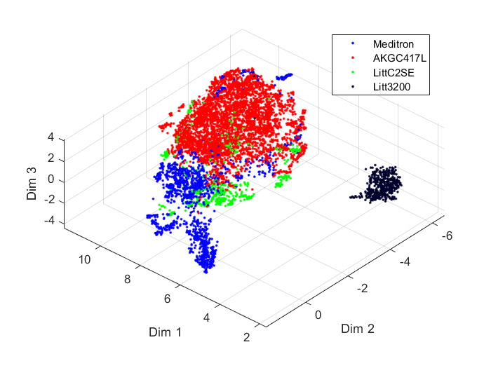
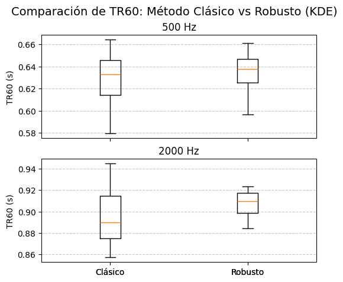

# 🎧 Sebastián Escobar Pajoy — Audio Developer & DSP Engineer

I am a freelance **audio developer** and **sound engineer** with a focus on:

* Development and prototyping of audio effect plugins
* Design of acoustic measurement and calibration tools
* Research and experimentation in signal processing and machine learning applied to sound

---

## 🎛️ Plugin Development & Prototyping

I build custom audio plugins and synthetizers for real-time sound manipulation using C++ (JUCE). My experience includes flanger, equalizer, metering tools, aimed at both creative and professional audio environments.
# DrawS: Wave Table Polyphonic Synthetizer

# Anger Flanger: LoFi Chorus and Flanger      
 

# MBRAKATOR: Virtual Bass

# ICE BEAR: Harmonic Exciter

---

## 🔊 Acoustic Tools Design

I design and develop tools for acoustic analysis and sound calibration, including:

# Sound level meters

# Calibration Utilities

# Reverb Time Measurement with automated source EQ

---

## 🧠 Research & Signal Processing

I work on research projects related to:

* Audio signal classification
* Feature extraction (spectral descriptors, temporal features)
* AI applied to sound
# Caracterisation of lung sounds depending on the chest location

# Clustarization of lung sounds

# Non parametric statistics applied to acoustics
  

---

### 📄 Selected Publications

**Computerized analysis of pulmonary sounds using uniform manifold projection**  
Chaos, Solitons & Fractals, Volume 166 · Dec 2022  https://www.sciencedirect.com/science/article/pii/S0960077922011092

- Visualization of pulmonary sounds using UMAP.  
- Discrimination of recording devices through spectral descriptors.  
- Spectral statistics correlate with chronic pulmonary disease status.  
- Fractional state space representation related to adventitious sounds.

**Auscultation chest locations are correlated with short term spectral features of pulmonary sounds**  
International Conference on Mathematical Analysis and Applications in Science and Engineering · Jun 2022  
- Analysis of respiratory sounds in chronic pulmonary disease patients.  
- Combination of dimensionality reduction and Procrustes analysis.  
- Graphical representation of pulmonary sound characteristics.
---

## 🔧 Skills & Tools

* **Languages:** C++, Python, Matlab, Pyspark
* **Frameworks:** JUCE,Pythorch, PyDub, Librosa, Scikit-learn
* **Data Platforms:** Power BI, Databricks, AWS
* **Version Control:** Git, GitHub

---

## 🛈 Contact

* **LinkedIn:** [linkedin.com/in/sesbastianep](www.linkedin.com/in/sebastián-escobar-pajoy)
* **GitHub:** [SesbastianEP29](https://github.com/SesbastianEP29)

---

*"Code what you hear, hear what you code."*
